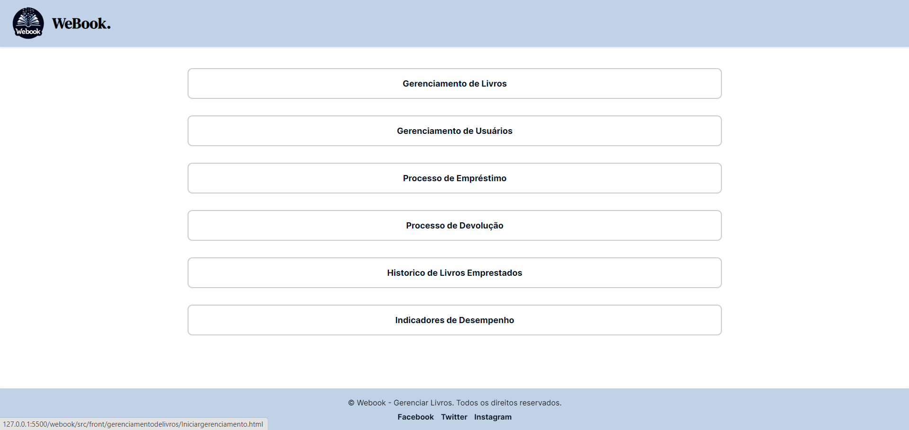

## 6. Interface do sistema

_Visão geral da interação do usuário por meio das telas do sistema. Apresente as principais interfaces da plataforma._

## 6.1. Tela principal do sistema

_Tela Inicial onde o bibliotecário terá 6 botões, sendo eles 4 dos processos do projeto e os outros 2 mostrando um histórico de livros emprestados e os indicadores de desempenho._

## 6.2. Telas do processo 1

_Descrição da tela relativa à atividade 1._

[`Tela da atividade 1`](images/)

_Descrição da tela relativa à atividade 2._

[`Tela da atividade 2`](images/)

## 6.3. Telas do processo 2

_Descrição da tela relativa à atividade 1._

[`Tela da atividade 1`](images/)

_Descrição da tela relativa à atividade 2._

[`Tela da atividade 2`](images/)

## 6.3. Telas do processo 3

_Descrição da tela relativa à atividade 1._

_Descrição da tela relativa à atividade 2._

## 6.3. Telas do processo 4

_Descrição da tela relativa à atividade 1._

_Descrição da tela relativa à atividade 2._

