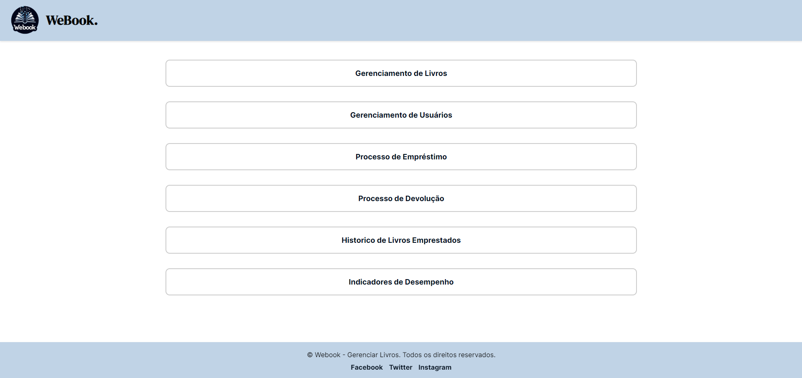
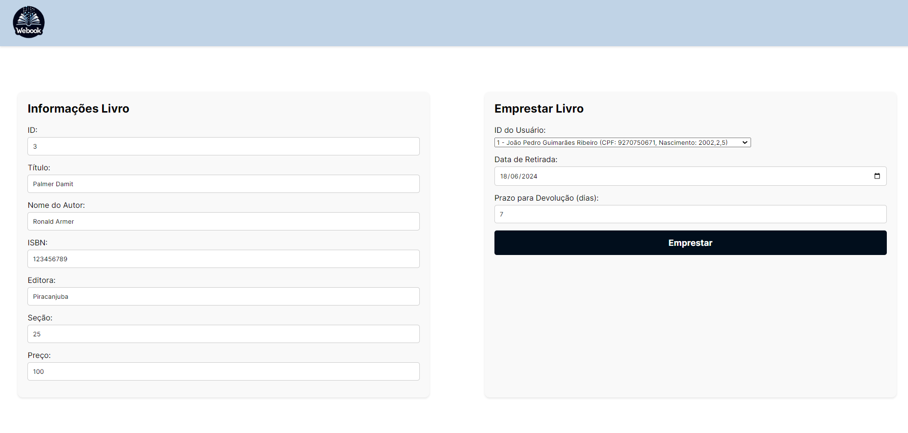
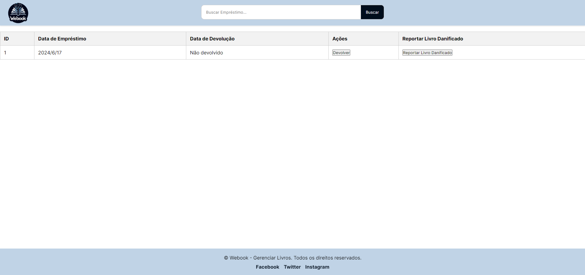
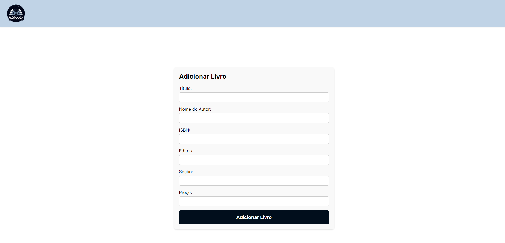
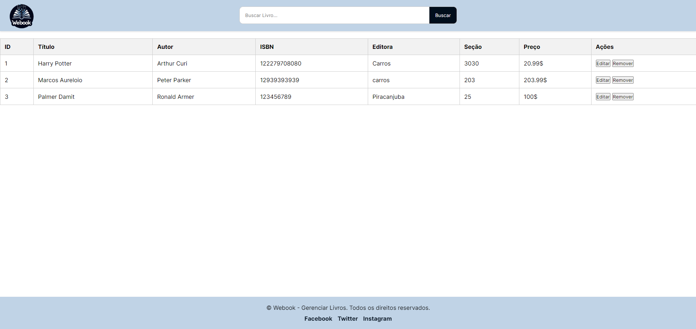
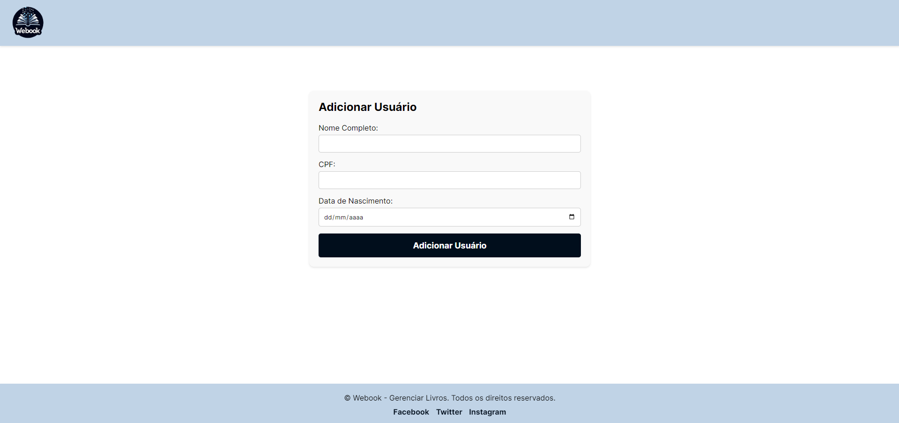
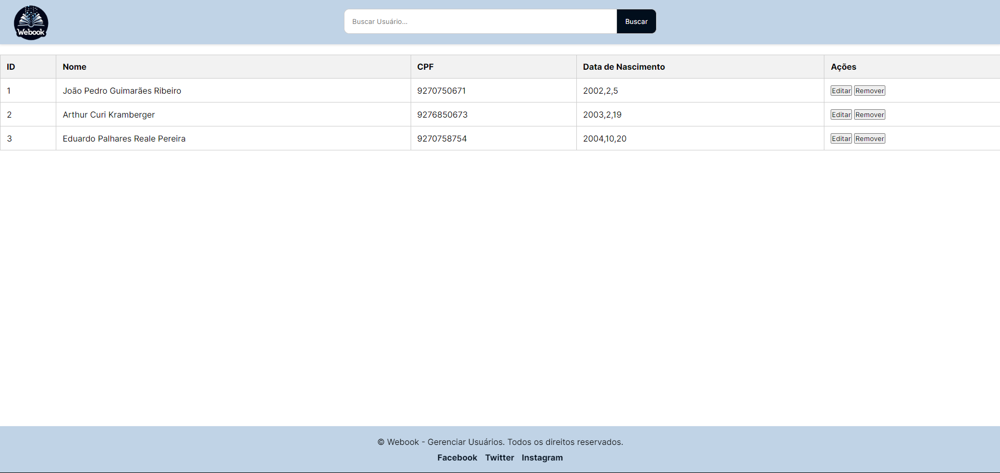
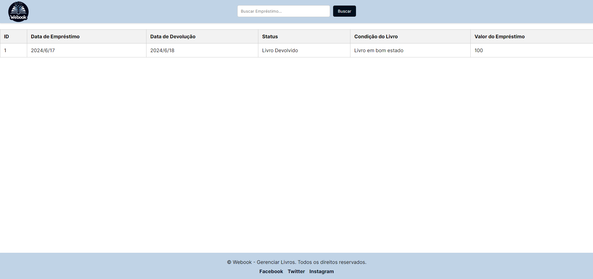
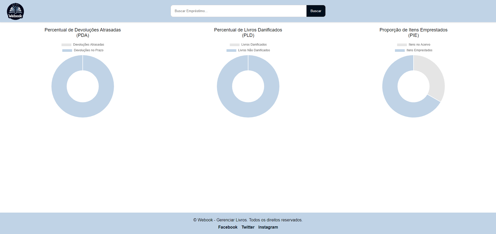

## 6. Interface do sistema

_Visão geral da interação do usuário por meio das telas do sistema. Apresente as principais interfaces da plataforma._

## 6.1. Tela principal do sistema

_Tela Inicial que apresenta 6 botões, sendo eles 4 dos processos do projeto e os outros 2 mostrando um histórico de livros emprestados e os indicadores de desempenho._

## 6.2. Telas do processo 1

_Tela de Empréstimo possuindo todas as informações do livro selecionado, para checagem, e um formulário para preencher qual usuário está solicitando o empréstimo, o prazo de devolução em dias e a data de retirada na biblioteca._

## 6.3. Telas do processo 2

_Tela de Devolução possuindo todos os livros que estão emprestados, mostrando quando foi retirado e dando duas opções de escolha caso queira devolver normalmente ou caso queira registrar alguma danificação ao livro._

## 6.4. Telas do processo 3

_Tela onde é preenchido o título, autor, ISBN, editora, seção e preço do livro que está sendo cadastrado._

_Tela onde é possível visualizar todos os livros já cadastrados com todas as devidas informações e 2 botões permitindo a edição ou remoção do livro selecionado._

## 6.5. Telas do processo 4

_Tela onde é preenchido o nome, CPF e data de nascimento do usuário que está sendo cadastrado._

_Tela onde é possível visualizar todos os usuários já cadastrados com todas as devidas informações e 2 botões permitindo a edição ou remoção do usuário selecionado._

## 6.6. Telas do Histórico de Empréstimos

_Tela onde é possível visualizar todos os empréstimos já realizados anteriormente, apresentando a data de retirada e devolução daquele livro, a condição na qual ele foi devolvido e o preço pago pelo usuário._

## 6.7. Telas dos Indicadores de Desempenho

_Tela onde é possível visualizar todos os empréstimos já realizados anteriormente, apresentando a data de retirada e devolução daquele livro, a condição na qual ele foi devolvido e o preço pago pelo usuário._

