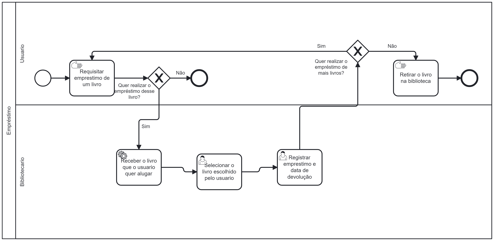

### 3.3.1 Processo 1 – Processo Empréstimo

#### Detalhamento das atividades

**Selecionar o livro escolhido pelo usuário -** O bibliotecário acessa uma tela que apresenta a mesma tabela de livros cadastrados anteriormente, com a barra de pesquisa que filtra de acordo com o livro pesquisado, todavia com o botão emprestar que leva para a próxima tela de Registrar Empréstimo.

**Registrar Empréstimo e data de devolução -** Essa tela so será acessada pelo bilbiotecário após clicar em emprestar um determinado livro. Nela o bibliotecário seguirá preenchendo as informações necessárias pra concluir o processo, sendo elas: ID do Usuário que requisitou o empréstimo, data de retirada, e o prazo de dias para devolução. Após concluir esses passos, o bibliotecário terá 2 botões, o de voltar a tela anterior, caso tenha cometido erros no preenchimento da data, e o de registrar a conclusão final do empréstimo. 

____________________________________________________________________________________________________________________________________________________________________

**Selecionar o livro escolhido pelo usuário**

| Campo       | Tipo         | Restrições | Valor default |
| ---             | ---              | ---            | ---               |
| Título do Livro     | Caixa de Texto   | ---  | Título do livro cadastrado          |
| Nome do Autor      | Caixa de Texto      | Apenas Letras  | Nome do autor cadastrado             |
| ISBN | Número  | 13 Caracteres           | IBNN do livro cadastrado                 |
| Editora | Caixa de Texto   | Apenas Letras  | Editora do livro cadastrado                 |
| Seção do Livro     | Caixa de Texto   | Apenas Letras  | Seção do livro cadastrado                 |
| Preço | Número   | ---   | Preço do livro cadastrado                 |
| Ações |  Caixa de Texto        | Não editável | Emprestar |

| Comandos         |  Destino                   | Tipo          |
| ---                  | ---                            | ---               |
| Botão Voltar         | Retorna para tela anterior     | Default           |
| Botão Emprestar      | Registrar empréstimo e data de devolução       | ---               |

____________________________________________________________________________________________________________________________________________________________________

**Registrar Empréstimo e data de devolução**

| **Campo**       | **Tipo**         | **Restrições** | **Valor default** |
| ---             | ---              | ---            | ---               |
| Título do Livro     | Caixa de Texto   | ---  | Título do livro cadastrado          |
| Nome do Autor      | Caixa de Texto      | Apenas Letras  | Nome do autor cadastrado             |
| ISBN | Número  | 13 Caracteres           | IBNN do livro cadastrado                 |
| Editora | Caixa de Texto   | Apenas Letras  | Editora do livro cadastrado                 |
| Seção do Livro     | Caixa de Texto   | Apenas Letras  | Seção do livro cadastrado                 |
| Preço | Número   | ---   | Preço do livro cadastrado                 |
| ID do Usuário          | Número   | 12 Caracteres | ---               |
| Data de Retirada          | Data   | --- |  ---              |
| Prazo pra Devolução          | Data   | Não editável |   ---          |
| Preço         | Número   | ---  | ---               |

| **Comandos**         |  **Destino**                   | **Tipo** |
| ---                  | ---                            | ---               |
| Botão Voltar               | Retorna para a tela anterior          | Default           |
| Botão Registrar               | Fim do processo          | Default           |

