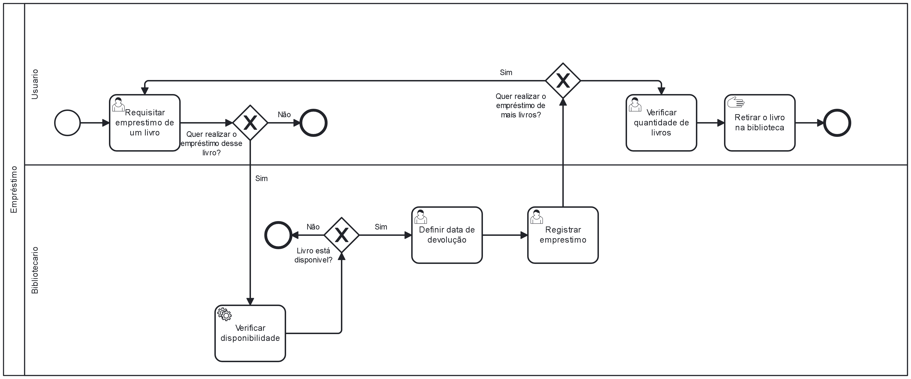

### 3.3.1 Processo 1 – Processo Empréstimo

#### Detalhamento das atividades

**Requisitar Empréstimo de um Livro -** Usuário entra na tela principal, também chamada de landing page, que apresenta uma barra de pesquisa que filtra o livro buscado pelo nome e um botão para buscar o livro digitado no sistema. Além disso, terá um botão principal que ocupará boa parte da tela de apresentação inicial. Ao clicar no botão, descerá a tela mostrando em cards as opções de livro com um botão embaixo de cada card permitindo com que o usuário escolha qual livro pegará emprestado.

**Definir Data de Devolução -** Bibliotecário recebe a requisição do livro feita pelo usuário e é direcionado pra uma tela onde preencherá o prazo de devolução que o usuário deve seguir, com o dia, mês e ano limite para retornar o livro à biblioteca. Após o registro da data, terá o botão para salvar essa data no sistema.

**Registrar Empréstimo -** Essa tela so será acessada pelo bilbiotecário após prencheer a tela de definição da data de devolução. Nela o bibliotecário seguirá preenchendo as informações necessárias pra concluir o processo, sendo elas: CPF do Usuário que requisitou o empréstimo, livro escolhido, data de retirada, o prazo definido na tela anterior e por fim o preço desse empréstimo. Após concluir esses passos, o bibliotecário terá 2 botões, o de voltar a tela anterior, caso tenha cometido erros no preenchimento da data, e o de registrar a conclusão final do empréstimo. 

**Verificar quantidade de livro -** Por fim, o usuário recebe uma tela com as informações básicas como o nome do livro escolhido, quantidade de livros que selecionou e o preco, somente para confirmar se está tudo conforme o solicitado para concluir o processo de Empréstimo. Caso tenha algo de errado, o usuário terá o botão voltar para retomar a requisição.

____________________________________________________________________________________________________________________________________________________________________

**Requisitar Empréstimo**

| **Campo**       | **Tipo**         | **Restrições** | **Valor default** |
| ---             | ---              | ---            | ---               |
| Pesquisa           | Área de Texto   | Apenas letras |  ---              |

| **Comandos**         |  **Destino**                   | **Tipo** |
| ---                  | ---                            | ---               |
| Botão Ver Livros               | Tela com as opções de livro              | default           |
| Botão Buscar               | Livro digitado na busca              | default           |
| Botão Escolher Livro             | Verificar quantidade de livros              | default           |

____________________________________________________________________________________________________________________________________________________________________

**Definir Data de Devolução**

| **Campo**       | **Tipo**         | **Restrições** | **Valor default** |
| ---             | ---              | ---            | ---               |
| Data Devolução                 |   Data               |       Somente datas futuras        |     ---              |

| **Comandos**         |  **Destino**                   | **Tipo**          |
| ---                  | ---                            | ---               |
| Botão Registrar Data                     |  Tela de Registrar Empréstimo                              |  default                 |

____________________________________________________________________________________________________________________________________________________________________

**Registrar Empréstimo**

| **Campo**       | **Tipo**         | **Restrições** | **Valor default** |
| ---             | ---              | ---            | ---               |
| CPF do Usuário          | Número   | 12 Caracteres | ---               |
| Livro Escolhido          | Caixa de Texto   | Apenas letras | ---               |
| Data de Retirada          | Data   | --- |  ---              |
| Prazo pra Devolução          | Data   |  Valor não editável |                |
| Preço         | Número   | ---  | ---               |

| **Comandos**         |  **Destino**                   | **Tipo** |
| ---                  | ---                            | ---               |
| Botão Voltar               | Retorna para a tela anterior          | default           |
| Botão Registrar               | Tela final de conclusão do empréstimo           | default           |

____________________________________________________________________________________________________________________________________________________________________

**Verificar Quantidade de Livros**

| **Campo**       | **Tipo**         | **Restrições** | **Valor default** |
| ---             | ---              | ---            | ---               |
| Informações do Empréstimo         | Tabela   | Valores não editáveis |    Livro Escolhido, Quantidade, Preço           |

| **Comandos**         |  **Destino**                   | **Tipo** |
| ---                  | ---                            | ---               |
| Botão Voltar               | Retorna para a tela de Requisição          | default           |
| Botão Concluir               | Fim do Processo          | ---           |
