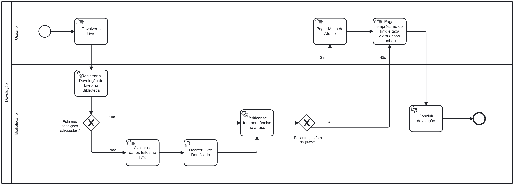

### 3.3.2 Processo 2 – Processo Devolução

#### **Detalhamento das atividades**
**Registrar a devolução do livro na biblioteca** - Bibliotecário entrará no sistema que apresenta uma tabela com todos os livros que estão emprestados. A tela mostra o ID do empréstimo, a data no qual foi realizado o empréstimo, a data de devolução do livro e as ações de Devolver, que registrará a devolução daquele determinado livro e a de Reportar Livro Danificado.

**Reportar Livro Danificado** - Bibliotecário apenas acessará essa tela a partir da tela do registro da devolução do livro, caso o livro tenha voltado com defeitos que não possuia antes. Essa tela possibilitará deixar registrado o ocorrido com o valor que será cobrado ao usuário pelos danos. Ela terá apenas um botão para dar sequência ao processo.

**Pagar multa de atraso** - O usuário receberá as informações de devolução enviadas pelo bibliotecário, contendo a data de retirada do livro e a data limite para a devolução que foi extrapolada. Neste caso, apresentará uma tela informando o valor de multa que será adicionado ao preço do empréstimo, para o pagamento em conjunto na tela seguinte.

___________________________________________________________________________________________________________________________________

**Registrar a devolução do livro**

| Campo       | Tipo         | Restrições | Valor default |
| ---             | ---              | ---            | ---               |
| ID    | Apenas Números   | Não editável  | ID do empréstimo          |
| Data de Empréstimo      | Date     | Não editável  | Data de empréstimo do livro            |
| Data de Devolução | Date  | Não editável            | Prazo de devolução do livro                |
| Ações |  Caixa de Texto        | Não editável | Devolver/Reportar |

| Comandos         |  Destino                   | Tipo          |
| ---                  | ---                            | ---               |
| Botão voltar         | Retorna para tela anterior     | Default           |
| Botão Devolver        | ??               | ---               |
| Botão Reportar Livro Danificado        | Reportar Livro Danificado  | Default          |
___________________________________________________________________________________________________________________________________

**Reportar Livro Danificado**

| **Campo**       | **Tipo**         | **Restrições** | **Valor default** |
| ---             | ---              | ---            | ---               |
| Valor taxa extra  | Número       | ---            | ---               |
| Motivo de taxa extra | Campo de texto  |    ---      |            ---   |

| **Comandos**         |  **Destino**                   | **Tipo**          |
| ---                  | ---                            | ---               |
| Botão de confirmar cobrança | Aguarda o usuário realizar o pagamento | Default |              

___________________________________________________________________________________________________________________________________

**Pagar multa de atraso**

| **Campo**       | **Tipo**         | **Restrições** | **Valor default** |
| ---             | ---              | ---            | ---               |
| Data de Retirada     | Data          | Não editável            | ---               |
| Data de Devolução    | Data          | Não editável            | ---               |
| Dias ultrapassados     | Campo de Texto          | Não editável            | ---               |
| Valor multa     | Número          | Não editável            | ---               |

| **Comandos**         |  **Destino**                   | **Tipo**          |
| ---                  | ---                            | ---               |
| Botão de continuar | Tela de pagamento final | Default |    

___________________________________________________________________________________________________________________________________

