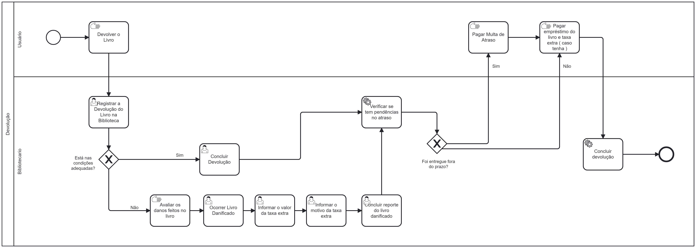

### 3.3.2 Processo 2 – Processo Devolução

#### **Detalhamento das atividades**
**Registrar a devolução do livro na biblioteca** - Bibliotecário entrará no sistema que apresenta uma tabela com todos os livros que estão emprestados. A tela mostra o ID do empréstimo, a data no qual foi realizado o empréstimo, a data de devolução do livro e as ações de Devolver, que registrará a devolução daquele determinado livro e a de Reportar Livro Danificado.

**Concluir Devolução** - Bibliotecário apenas conclui a devolução do livro a partir de um botão OK.

**Informar valor da Taxa Extra** - Bibliotecário informa o valor que será cobrado devido a devolução de um livro danificado.

**Informar motivo da Taxa Extra** - Bibliotecário informa o motivo do por que será cobrado a taxa extra do livro danificado.

**Concluir reporte do livro danificado** - Bibliotecário apenas conclui o reporte do livro danificado a partir de um botão OK.

___________________________________________________________________________________________________________________________________

**Registrar a devolução do livro**

| Campo       | Tipo         | Restrições | Valor default |
| ---             | ---              | ---            | ---               |
| ID    | Apenas Números   | Não editável  | ID do empréstimo          |
| Data de Empréstimo      | Date     | Não editável  | Data de empréstimo do livro            |
| Data de Devolução | Date  | Não editável            | Prazo de devolução do livro                |
| Ações |  Caixa de Texto        | Não editável | Devolver/Reportar |

| Comandos         |  Destino                   | Tipo          |
| ---                  | ---                            | ---               |
| Botão voltar         | Retorna para tela anterior     | Default           |
| Botão Devolver        | Concluir Devolução               | ---               |
| Botão Reportar Livro Danificado        | Informar o valor da taxa extra  | Default          |
___________________________________________________________________________________________________________________________________

**Informar o valor da taxa extra**

| **Campo**       | **Tipo**         | **Restrições** | **Valor default** |
| ---             | ---              | ---            | ---               |
| Valor da taxa extra     | Número          | ---            | ---               |

| **Comandos**         |  **Destino**                   | **Tipo**          |
| ---                  | ---                            | ---               |
| Botão OK | Informar o motivo da taxa extra | Default |    

___________________________________________________________________________________________________________________________________

**Informar o motivo da taxa extra**

| **Campo**       | **Tipo**         | **Restrições** | **Valor default** |
| ---             | ---              | ---            | ---               |
| Motivo da taxa extra     | Caixa de Texto          | ---            | ---               |

| **Comandos**         |  **Destino**                   | **Tipo**          |
| ---                  | ---                            | ---               |
| Botão OK | Concluir reporte do livro danificado | Default |    

___________________________________________________________________________________________________________________________________

**Confirmar Devolução**

| **Comandos**         |  **Destino**                   | **Tipo**          |
| ---                  | ---                            | ---               |
| Botão OK | Fim do Processo | Default |    

___________________________________________________________________________________________________________________________________

**Concluir reporte do livro danificado**

| **Comandos**         |  **Destino**                   | **Tipo**          |
| ---                  | ---                            | ---               |
| Botão OK | Fim do Processo | Default |    
