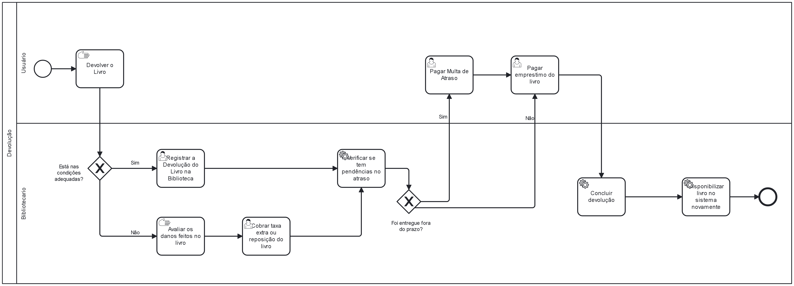

### 3.3.2 Processo 2 – Processo Devolução

#### **Detalhamento das atividades**
**Registrar a devolução do livro na biblioteca** - Bibliotecario entra na tela do registro da devolução de livros. A tela possui 4 botões, um que leva à pagina anterior, um que leva a uma tela que registra que uma multa foi paga devido à danos no livro. Além desses botões, nessa mesma tela temos a opção de verificar se o livro está com atraso na devolução ou não, preenchendo as informações do cliente ou do proprio livro (é possivel pelos 2 caminhos). E os ultimos 2 botões levam a outras 2 telas diferentes, que são a de pagamento de multa e a do pagamento do empréstimo do livro.

**Cobrar taxa extra** - Bibliotecario apenas acessará essa tela a partir da tela do registro da devolução do livro caso o livro tenha voltado com defeitos que não possuia antes. Essa tela possibilitará deixar registrado o ocorrido com o livro caso ocorram futuras duvidas em relação ao ocorrido. Além de tudo, essa tela possuirá apenas um botão para que o bibliotecario possa retornar à tela de registro de devolção.

**Pagar multa de atraso** - Essa tela so será acessada pelo bilbiotecario a partir da tela de devolução de livros caso o usuário tenha atraso na data de devolução do livro. A tela possuirá as opções de pagamento do cliente com o valor já calculado pelo proprio software na tela. Essa tela possuirá apenas um botão para que o bibliotecario possa voltar à tela de devolução de livro apos o pagamento da multa.

**Pagar o empréstimo do livro** - Após todo o processo verificado e executado, o bilbiotecario passará obrigatoriamente por essa tela para que o cliente possa pagar o valor do empréstimo do livro. Essa possuirá o valor ja calculado do empréstimo pelo software e oferecerá as opções de pagamento disponíveis ao usuário. A tela possuirá apenas um botão para confirmar que o pagamento foi executado. O botão será ativado manualmente pelo bibliotecario apenas após a confirmação de pagamento feita pelo cliente.

_Os tipos de dados a serem utilizados são:_

_* **Área de texto** - campo texto de múltiplas linhas_

_* **Caixa de texto** - campo texto de uma linha_

_* **Número** - campo numérico_

_* **Data** - campo do tipo data (dd-mm-aaaa)_

_* **Hora** - campo do tipo hora (hh:mm:ss)_

_* **Data e Hora** - campo do tipo data e hora (dd-mm-aaaa, hh:mm:ss)_

_* **Imagem** - campo contendo uma imagem_

_* **Seleção única** - campo com várias opções de valores que são mutuamente exclusivas (tradicional radio button ou combobox)_

_* **Seleção múltipla** - campo com várias opções que podem ser selecionadas mutuamente (tradicional checkbox ou listbox)_

_* **Arquivo** - campo de upload de documento_

_* **Link** - campo que armazena uma URL_

_* **Tabela** - campo formado por uma matriz de valores_

**Tela de Registrar a devolção do livro**

| **Campo**       | **Tipo**         | **Restrições** | **Valor default** |
| ---             | ---              | ---            | ---               |
| Não tem |Caixa de texto |     Não tem           |      ---             |

| **Comandos**         |  **Destino**                   | **Tipo** |
| ---                  | ---                            | ---               |
|  Botão Pagar da taxa extra | Leva à tela de pagamento de taxa extra  | (default) |
| Botão de Pagar multa de atraso     |        Leva à tela de pagamento de multa                        |           (default)        |
| Botão de Pagar empréstimo do livro           |         Leva à tela de pagar empréstimo do livro      | (default)          |
| Botão de voltar à tela antecessora        | Leva à tela antecessora  |         (default)          |

___________________________________________________________________________________________________________________________________

**Tela de pagamento de taxa extra**

| **Campo**       | **Tipo**         | **Restrições** | **Valor default** |
| ---             | ---              | ---            | ---               |
| Opções de pagamento | Seleção única  |         Não tem      |            ---   |                                                                 

| **Comandos**         |  **Destino**                   | **Tipo**          |
| ---                  | ---                            | ---               |
| Botão de confirmar pagamento ("Ja paguei")| Leva à tela de Registrar devolução de livro de volta | (default) |              

___________________________________________________________________________________________________________________________________

**Tela de pagamento de multa**

| **Campo**       | **Tipo**         | **Restrições** | **Valor default** |
| ---             | ---              | ---            | ---               |
| Opções de pagamento | Seleção única  |         Não tem      |            ---   |                                                                 

| **Comandos**         |  **Destino**                   | **Tipo**          |
| ---                  | ---                            | ---               |
| Botão de confirmar pagamento ("Ja paguei")| Leva à tela de Registrar devolução de livro de volta | (default) |      
