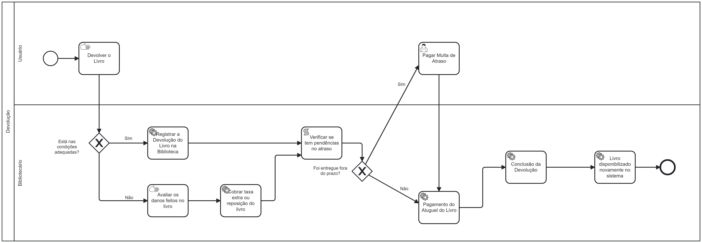

### 3.3.2 Processo 2 – Processo Devolução

#### **Detalhamento das atividades**
**Registrar a devolução do livro na biblioteca** - Bibliotecário entrará no sistema para registrar as informações do livro devolvido pelo usuário, como Título do Livro, a seção que ele pertence e o CPF do usuário que fez a retirada, após isso, ele terá a opção de continuar para uma tela de taxa extra, caso tenha notado diferenças na condição que o livro se encontra. Caso esteja nas condições adequadas, ele por fim checa as datas de retirada e devolução no sistema e da sequência ao processo. 

**Cobrar taxa extra** - Bibliotecário apenas acessará essa tela a partir da tela do registro da devolução do livro, caso o livro tenha voltado com defeitos que não possuia antes. Essa tela possibilitará deixar registrado o ocorrido com o valor que será cobrado ao usuário pelos danos. Ela terá apenas um botão para dar sequência ao processo.

**Pagar multa de atraso** - O usuário receberá as informações de devolução enviadas pelo bibliotecário, contendo a data de retirada do livro e a data limite para a devolução que foi extrapolada. Neste caso, apresentará uma tela informando o valor de multa que será adicionado ao preço do empréstimo, para o pagamento em conjunto na tela seguinte.

**Pagar o empréstimo do livro** - Após todo o processo verificado e executado, o usuário recebe uma tela com o preço inteiro a ser pago, já considerando as taxas de dano e multa, caso apresente alguma delas, e as meios de pagamento a serem utilizados. Após a conclusão do mesmo, o usuário apresenta o comprovante e o livro é disponibilizado novamente no sistema.

___________________________________________________________________________________________________________________________________

**Registrar a devolção do livro**

| **Campo**       | **Tipo**         | **Restrições** | **Valor default** |
| ---             | ---              | ---            | ---               |
| CPF do usuário     | Número          | 12 Caracteres           | ---               |
| Título do Livro    | Campo de Texto          | ---            | ---               |
| Seção do Livro     | Campo de Texto          | ---            | ---               |
| Data de Retirada     | Data          | Não editável            | ---               |
| Data de Devolução    | Data          | Não editável            | ---               |

| **Comandos**         |  **Destino**                   | **Tipo**          |
| ---                  | ---                            | ---               |
| Botão de continuar | Aguarda o usuário realizar o pagamento | Default |    
| Botão de cobrar taxa extra | Tela de cobrar taxa extra | Default |   
| Botão devolução atrasada | Tela de pagar multa atraso | Default |   

___________________________________________________________________________________________________________________________________

**Cobrar taxa extra ou devolução do livro**

| **Campo**       | **Tipo**         | **Restrições** | **Valor default** |
| ---             | ---              | ---            | ---               |
| Valor taxa extra  | Número       | ---            | ---               |
| Motivo de taxa extra | Campo de texto  |    ---      |            ---   |

| **Comandos**         |  **Destino**                   | **Tipo**          |
| ---                  | ---                            | ---               |
| Botão de confirmar cobrança | Aguarda o usuário realizar o pagamento | Default |              

___________________________________________________________________________________________________________________________________

**Pagar multa de atraso**

| **Campo**       | **Tipo**         | **Restrições** | **Valor default** |
| ---             | ---              | ---            | ---               |
| Data de Retirada     | Data          | Não editável            | ---               |
| Data de Devolução    | Data          | Não editável            | ---               |
| Dias ultrapassados     | Campo de Texto          | Não editável            | ---               |
| Valor multa     | Número          | Não editável            | ---               |

| **Comandos**         |  **Destino**                   | **Tipo**          |
| ---                  | ---                            | ---               |
| Botão de continuar | Tela de pagamento final | Default |    

___________________________________________________________________________________________________________________________________

**Pagar o empréstimo do livro**

| **Campo**       | **Tipo**         | **Restrições** | **Valor default** |
| ---             | ---              | ---            | ---               |
| Valor final      | Número        | ---            | ---               |
| Opções de pagamento | Seleção única  |  ---    |            ---   |
| Numero cartão | Número |  Após escolher cartão de débito/crédito   |         ---   | 
| Data de vencimento | Número |  Após escolher cartão de débito/crédito   |         ---   |      
| Código de segurança | Número |  Após escolher cartão de débito/crédito   |         ---   | 
| Nome do dono do cartão | Campo de texto |  Após escolher cartão de débito/crédito   |         ---   | 
| QR Code do PIX | Imagem |  Após escolher PIX   |         ---   |                                                                  

| **Comandos**         |  **Destino**                   | **Tipo**          |
| ---                  | ---                            | ---               |
| Botão de confirmar pagamento | Fim do processo de devolução | Default |    

