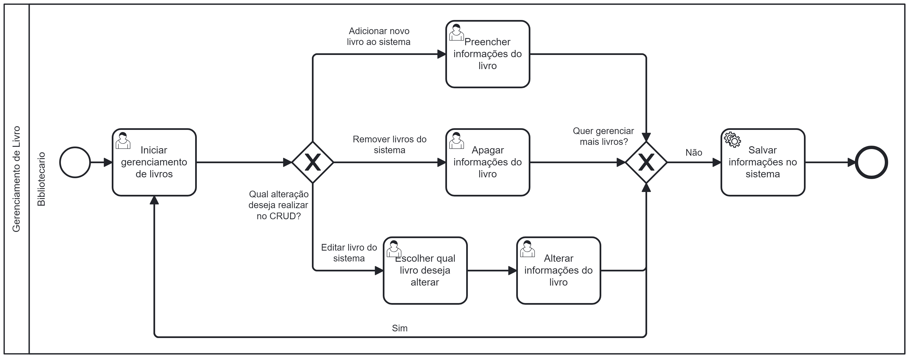

### 3.3.3 Processo 3 – Processo Gerenciamento de Livros

#### Detalhamento das atividades

**Iniciar gerenciamento de livros -**
O bibliotecário irá acessar a tela de gerenciamento de livro, nela haverá 4 botões uma que irá levar para a tela de adicionar uma livro, um que leve para a tela de remoção de livros, um que irá levar para a página de alteração e um botão para voltar

**Preencher informações  do livro (nome, seçao, autor) -**
O bibliotecário então é redirecionado para a tela de cadastro de livro nela haverá 3 campos de texto: um para inserir o Nome do livro, outro para a seção do livro e outro para o nome do Autor. Também haverá um botão para voltar e outro para cadastrar.

**Apagar informações do livro -**
O bibliotecário então é redirecionado para uma tela com um campo de seleção múltipla com todos os livros cadastrados ele então poderá selecionar um ou mais para serem removidos. Nela haverá um campo com seleção múltipla contendo todos os livros cadastrados. Também haverá um botão para voltar e outro para remover.

**Alterar informações do livro -**
O bibliotecário então é redirecionado para uma tela com um capo para seleção única contendo todos os livros cadastrados, ao selecionar um livro 3 novos campos de área de texto irão aparecer sendo eles o Nome, a Seção e o Autor do livros selecionado com os valores que foram cadastrados ele então poderá alterar os campos. Também haverá um botão para voltar e outro para alterar.

**Iniciar gerenciamento de livros**

| **Comandos**         |  **Destino**                   | **Tipo** |
| ---                  | ---                            | ---               |
| Botão adicionar      | Início processo de cadastro de livro     | Default           |
| Botão alterar        | Início do processo alteração             | Default           |
| Botão remover        | Inicio Processo de remoção               | Default           |
| Botão voltar         | Retorna para tela anterior               | Default           |

___________________________________________________________________________________________________________________________________

**Preencher informações  do livro (nome, seçao, autor)**

| **Campo**       | **Tipo**         | **Restrições** | **Valor default** |
| ---             | ---              | ---            | ---               |
| Nome Livro      | Caixa de Texto   | Sem Restrição  | ---               |
| Seção Livro     | Caixa de Texto   | Apenas Letras  | ---               |
| Nome Autor      | Caixa de Texto   | Apenas Letras  | ---               |
| Ano publicação  | Caixa de Texto   | Apenas Letras  | ---               |
| Título Original | Caixa de Texto   | Apenas Letras  | ---               |
| Editora | Caixa de Texto   | Apenas Letras  | ---               |
| Preço | Número   | ---   | ---               |
| Quantidade de páginas | Número  | ---     | ---               |
| ISBN | Número  | ---     | ---               |

| **Comandos**         |  **Destino**                   | **Tipo**          |
| ---                  | ---                            | ---               |
| Botão voltar         | Retorna para tela anterior     | Default           |
| Botão cadastro       | Fim do processo                | ---               |

___________________________________________________________________________________________________________________________________

**Apagar informações do livro**

| **Campo**       | **Tipo**         | **Restrições** | **Valor default** |
| ---             | ---              | ---            | ---               |
| Livros Cadastrados | Seleção única | Sem restrição  | Nome Livro Cadastrado |       |                   |

| **Comandos**         |  **Destino**                   | **Tipo**          |
| ---                  | ---                            | ---               |
| Botão voltar         | Retorna para tela anterior     | Default           |
| Botão remover        | Fim do processo                | ---               |

___________________________________________________________________________________________________________________________________

**Escolher qual livro deseja alterar**

| **Campo**       | **Tipo**         | **Restrições** | **Valor default** |
| ---             | ---              | ---            | ---               |
| Livros Cadastrados | Seleção única   | Sem Restrição  | Nome Livro Cadastrado |

| **Comandos**         |  **Destino**                   | **Tipo**          |
| ---                  | ---                            | ---               |
| Botão voltar         | Retorna para tela anterior     | Default           |
| Botão alterar        | Alterar informações do livro   | ---               |
___________________________________________________________________________________________________________________________________

**Alterar informações do livro**

| **Campo**       | **Tipo**         | **Restrições** | **Valor default** |
| ---             | ---              | ---            | ---               |
| Nome Livro         | Caixa de Texto   | Após a seleção do livro  | ---               |
| Seção Livro        | Caixa de Texto   | Após a seleção do livro  | ---               |
| Nome Autor         | Caixa de Texto   | Após a seleção do livro  | ---               |
| Ano publicação  | Caixa de Texto   | Após a seleção do livro  | ---               |
| Título Original | Caixa de Texto   | Após a seleção do livro  | ---               |
| Editora | Caixa de Texto   | Apenas Letras  | ---               |
| Preço | Número   | ---   | ---               |
| Quantidade de páginas | Número  | ---     | ---               |
| ISBN | Número  | ---     | ---               |

| **Comandos**         |  **Destino**                   | **Tipo**          |
| ---                  | ---                            | ---               |
| Botão voltar         | Retorna para tela anterior     | Default           |
| Botão alterar        | Fim do processo                | ---               |

