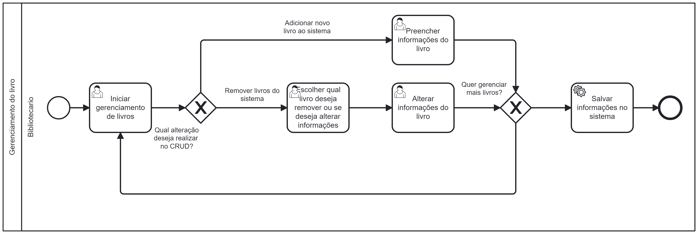

### 3.3.3 Processo 3 – Processo Gerenciamento de Livros

#### Detalhamento das atividades

**Iniciar gerenciamento de livros -**
O bibliotecário irá acessar a tela de gerenciamento de livro, nela haverá 4 botões uma que irá levar para a tela de adicionar uma livro, um que leve para a tela de remoção de livros, um que irá levar para a página de alteração e um botão para voltar

**Preencher informações  do livro (nome, seçao, autor) -**
O bibliotecário então é redirecionado para a tela de cadastro de livro nela haverá 3 campos de texto: um para inserir o Nome do livro, outro para a seção do livro e outro para o nome do Autor. Também haverá um botão para voltar e outro para cadastrar.

**Apagar informações do livro -**
O bibliotecário então é redirecionado para uma tela com um campo de seleção múltipla com todos os livros cadastrados ele então poderá selecionar aquele que deseja remover. Nela haverá um campo com seleção única contendo todos os livros cadastrados. Também haverá um botão para voltar e outro para remover.

**Alterar informações do livro -**
O bibliotecário então é redirecionado para uma tela com um capo para seleção única contendo todos os livros cadastrados, ao selecionar um livro 3 novos campos de área de texto irão aparecer sendo eles o Nome, a Seção e o Autor do livros selecionado com os valores que foram cadastrados ele então poderá alterar os campos. Também haverá um botão para voltar e outro para alterar.

___________________________________________________________________________________________________________________________________

**Iniciar gerenciamento de livros**

| **Comandos**         |  **Destino**                   | **Tipo** |
| ---                  | ---                            | ---               |
| Botão adicionar      | Início processo de cadastro de livro     | Default           |
| Botão remover ou editar      | Inicio Processo de remoção               | Default           |
| Botão voltar         | Retorna para tela anterior               | Default           |

___________________________________________________________________________________________________________________________________

**Preencher informações  do livro**

| **Campo**       | **Tipo**         | **Restrições** | **Valor default** |
| ---             | ---              | ---            | ---               |
| Título do Livro     | Caixa de Texto   | Sem Restrição  | ---               |
| Nome do Autor      | Caixa de Texto   | Apenas Letras  | ---               |
| ISBN | Número  | 13 Caracteres     | ---               |
| Editora | Caixa de Texto   | Apenas Letras  | ---               |
| Seção do Livro     | Caixa de Texto   | Apenas Letras  | ---               |
| Preço | Número   | ---   | ---               |

| **Comandos**         |  **Destino**                   | **Tipo**          |
| ---                  | ---                            | ---               |
| Botão voltar         | Retorna para tela anterior     | Default           |
| Botão cadastro       | Fim do processo                | ---               |

___________________________________________________________________________________________________________________________________

**Escolher qual livro deseja remover ou se deseja alterar**

| **Campo**       | **Tipo**         | **Restrições** | **Valor default** |
| ---             | ---              | ---            | ---               |
| Título do Livro     | Caixa de Texto   | Sem Restrição  | Titulo do livro cadastrado          |
| Nome do Autor      | Caixa de Texto      | Apenas Letras  | Nome do autor cadastrado             |
| ISBN | Número  | 13 Caracteres           | IBNN do livro cadastrado                 |
| Editora | Caixa de Texto   | Apenas Letras  | Editora do livro cadastrado                 |
| Seção do Livro     | Caixa de Texto   | Apenas Letras  | Seção do livro cadastrado                 |
| Preço | Número   | ---   | Preço do livro cadastrado                 |
| Ações |  Caixa de Texto        | Não alteravel | Remover/Editar |

| **Comandos**         |  **Destino**                   | **Tipo**          |
| ---                  | ---                            | ---               |
| Botão voltar         | Retorna para tela anterior     | Default           |
| Botão remover        | Fim do processo                | ---               |
| Botão editar        | Encaminha para tela de editar livros  | Default          |

___________________________________________________________________________________________________________________________________

**Alterar informações do livro**

| **Campo**       | **Tipo**         | **Restrições** | **Valor default** |
| ---             | ---              | ---            | ---               |
| Título do Livro     | Caixa de Texto   | Sem Restrição  | Titulo do livro cadastrado          |
| Nome do Autor      | Caixa de Texto      | Apenas Letras  | Nome do autor cadastrado             |
| ISBN | Número  | 13 Caracteres           | IBNN do livro cadastrado                 |
| Editora | Caixa de Texto   | Apenas Letras  | Editora do livro cadastrado                 |
| Seção do Livro     | Caixa de Texto   | Apenas Letras  | Seção do livro cadastrado                 |
| Preço | Número   | ---   | Preço do livro cadastrado                 |

| **Comandos**         |  **Destino**                   | **Tipo**          |
| ---                  | ---                            | ---               |
| Botão voltar         | Retorna para tela anterior     | Default           |
| Botão alterar        | Fim do processo                | ---               |

