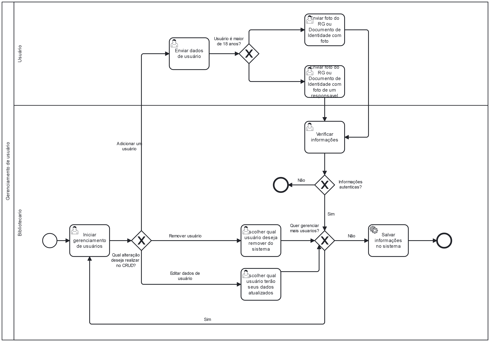

### 3.3.4 Processo 4 – Processo Gerenciamento de Usuário

#### Detalhamento das atividades

_Descreva aqui cada uma das propriedades das atividades do processo 3. 
Devem estar relacionadas com o modelo de processo apresentado anteriormente._

_Os tipos de dados a serem utilizados são:_

_* **Área de texto** - campo texto de múltiplas linhas_

_* **Caixa de texto** - campo texto de uma linha_

_* **Número** - campo numérico_

_* **Data** - campo do tipo data (dd-mm-aaaa)_

_* **Hora** - campo do tipo hora (hh:mm:ss)_

_* **Data e Hora** - campo do tipo data e hora (dd-mm-aaaa, hh:mm:ss)_

_* **Imagem** - campo contendo uma imagem_

_* **Seleção única** - campo com várias opções de valores que são mutuamente exclusivas (tradicional radio button ou combobox)_

_* **Seleção múltipla** - campo com várias opções que podem ser selecionadas mutuamente (tradicional checkbox ou listbox)_

_* **Arquivo** - campo de upload de documento_

_* **Link** - campo que armazena uma URL_

_* **Tabela** - campo formado por uma matriz de valores_

**Iniciar Gerenciamento de Usuários**

| **Campo**       | **Tipo**         | **Restrições** | **Valor default** |
| ---             | ---              | ---            | ---               |
| Não tem         | Não tem          | Não tem        | Não tem           |

| **Comandos**         |  **Destino**                   | **Tipo** |
| ---                  | ---                            | ---               |
| Botão adicionar      | Início processo de cadastro de usuario    | Default           |
| Botão remover        | Início Do processo alteração             | Default           |
| Botão alterar        | Inicio Processo de remoção               | Default           |
| Botão voltar         | Retorna para tela anterior               | Default           |

**Nome da atividade 2**

| **Campo**       | **Tipo**         | **Restrições** | **Valor default** |
| ---             | ---              | ---            | ---               |
| [Nome do campo] | [tipo de dados]  |                |                   |
|                 |                  |                |                   |

| **Comandos**         |  **Destino**                   | **Tipo**          |
| ---                  | ---                            | ---               |
| [Nome do botão/link] | Atividade/processo de destino  | (default/cancel/  ) |
|                      |                                |                   |
