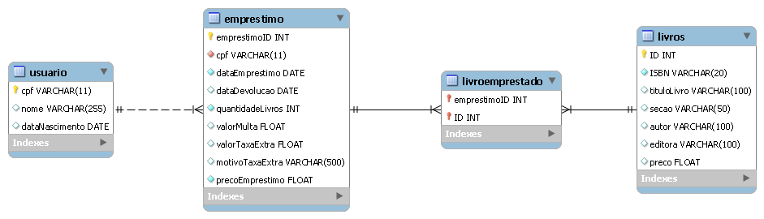

## 4. Projeto da solução

### 4.1. Modelo de dados

---

### 4.2. Tecnologias

_Descreva qual(is) tecnologias você vai usar para resolver o seu problema, ou seja, implementar a sua solução. Liste todas as tecnologias envolvidas, linguagens a serem utilizadas, serviços web, frameworks, bibliotecas, IDEs de desenvolvimento, e ferramentas._

| **Dimensão**   | **Tecnologia**  | **Utilização** |
| ---            | ---             | ---            |
| SGBD           | MySQL           |                |
| Front-end      | HTML + CSS + JS     |                |
| Back-end       | Java  |  Linguagem de programação usada para o desenvolvimento do back-end  |
| Deploy         | Github    |  Salvar versões dos arquivos no repositório remoto   |

